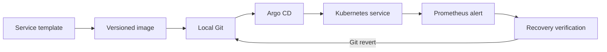

# Architecture and decisions

## Delivery loop

kind provides the local cluster; Cilium enforces its network policies. The recovery command coordinates the deliberate failure and Git revert. Prometheus detects the error rate; it does not initiate the revert.

## One source of truth

`templates/service/` defines the workload contract. `cluster/` holds the platform manifests. Kustomize generates the Prometheus ConfigMap name, so configuration changes trigger a rollout without custom hash code.

The CLI invokes Docker, kind, Helm, kubectl and Git with argument arrays and bounded timeouts. It retains reports and a small local source registry so it can build a second image for the recovery exercise. It does not implement a Kubernetes controller or a templating framework.

## Git transport and storage

Argo CD reads Git over the in-cluster Git protocol. Anonymous writes are disabled. Writes use Git's external transport through authenticated `kubectl exec`; the AppProject limits workload reconciliation to Deployments and Services in `keel-apps`.

The Git volume survives pod replacement, but not deletion of the kind cluster. The local Git working copy retains the history needed to repopulate that volume. This is an isolated demo transport, not a recommendation to give application developers cluster-admin access in production.

## Network and runtime boundaries

Cilium enforces Kubernetes NetworkPolicies. Application pods accept traffic from `keel-system`; untrusted namespaces are denied. Git permits in-cluster reads from Argo CD. Workload, Git and Prometheus containers run non-root with dropped capabilities and a read-only root filesystem. Platform namespaces use restricted Pod Security admission, except the upstream Argo CD namespace.

## Dependencies

Base images are digest-pinned, Python packages use hashes, upstream Argo CD and Cilium downloads are checksum-verified, and direct CI actions are pinned by commit. Updates require a deliberate lock change and verification. Built application image tags contain a source hash; these are local build identifiers, not registry digests.

## Deliberate limits

There is one node and one replica per service. The sample HTTP server is only a demonstration workload. Prometheus storage is ephemeral; the error-rate alert is evaluated over 30 seconds and is not a long-window production error-budget policy. No claim is made about HA, cloud IAM, production tenant isolation or external incident routing.
